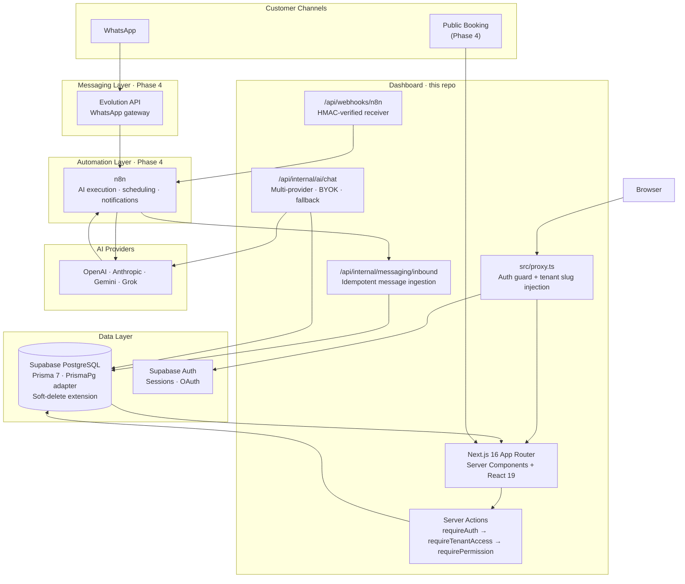

# MedFlow

Multi-tenant appointment management platform for clinics — operators manage bookings, patients, team, and AI-assisted conversations from a single dashboard.

Built from firsthand experience running a WhatsApp booking assistant across 3 clinics in Hyderabad. MedFlow is the productized version: multi-tenant, role-based, and designed to automate the full booking lifecycle via WhatsApp + AI.

**Stack:** Next.js 16 · TypeScript · PostgreSQL · Prisma 7 · Supabase · Tailwind CSS v4

**Status:** In Development — Phases 1–3.5 complete ([roadmap](#roadmap))

---

<!-- Screenshot placeholder -->
<!-- Add a screenshot of the dashboard home page here -->
<!-- Suggested: 1280×800px, showing stat cards + sidebar + upcoming appointments -->

---

## At a Glance

| | |
|---|---|
| **Problem** | Clinics juggle patient bookings over WhatsApp, calls, and DMs with no unified view, no audit trail, and no way to scale without adding staff. |
| **Solution** | A multi-tenant SaaS dashboard where each clinic manages appointments, patients, team, and AI conversations. Connects to WhatsApp via n8n + Evolution API for automated AI-driven booking — staff get involved only when the AI escalates. |
| **What's built** | Auth, multi-tenant routing, full CRUD, AI inbox (multi-provider), analytics, RBAC, AES-256-GCM encryption, audit logging, inbound messaging pipeline |
| **What's next** | n8n workflow orchestration, WhatsApp integration, public self-service booking, Stripe billing |

---

## Architecture



---

## Technical Highlights

### 8-Layer Security Model

Authentication, authorization, data isolation, and encryption are enforced independently at each layer — not just in configuration.

1. **Transport** — HTTPS + HSTS (`Strict-Transport-Security: max-age=2592000; includeSubDomains`)
2. **HTTP headers** — `X-Frame-Options`, `X-Content-Type-Options`, `Referrer-Policy`, `Permissions-Policy` set globally in `next.config.ts`
3. **Auth** — `src/proxy.ts` calls `supabase.auth.getUser()` (not `getSession()`) on every protected request, redirecting unauthenticated users before any route handler runs
4. **Authorization** — Every server action calls `requireAuth()` → `requireTenantAccess()` → `requirePermission(role, permission)` in sequence. Skipping any of these throws before the Prisma query runs
5. **Data isolation** — All Prisma queries include `tenantId` in `WHERE`. The middleware extracts the slug and injects it as a header; server actions resolve it to a verified `tenantId`
6. **Encryption at rest** — BYOK API keys stored as `iv:authTag:ciphertext` (AES-256-GCM, 96-bit IV, 128-bit auth tag). Decrypted only at runtime inside the server action — never logged, never returned to the client
7. **Audit trail** — `logAudit()` is called after sensitive mutations (cancellations, deactivations, settings changes). Fire-and-forget: audit failures never disrupt the primary action
8. **Soft deletes** — A Prisma `$extends` hook automatically injects `deletedAt: null` into all `findMany`, `findFirst`, and `findUnique` calls on soft-deletable models. No hard deletes in the application layer

See [docs/adr/ADR-005-security-model.md](docs/adr/ADR-005-security-model.md) for the full decision record.

---

### Multi-Tenant Isolation

Each clinic is a tenant. URL routing, middleware, ORM queries, and the permission system all enforce tenant boundaries independently.

- Routes follow `/{tenant-slug}/{section}`. `src/proxy.ts` extracts the slug from the URL and injects it as `x-tenant-slug` for downstream use
- `requireTenantAccess(slug)` resolves slug → `tenantId` and verifies the authenticated user has a `TenantMember` record for that tenant — before returning `tenantId` to the server action
- Every Prisma query that touches tenant data includes `{ where: { tenantId } }`. There is no way to read another tenant's data through normal code paths
- The schema includes a `parentTenantId` field on `Tenant` for agency → client hierarchies, with a dedicated `agency.manage_businesses` permission

See [docs/adr/ADR-006-multi-tenant-isolation.md](docs/adr/ADR-006-multi-tenant-isolation.md).

---

### Multi-Provider AI Abstraction

The AI layer is a pluggable provider interface behind a single `getAIProvider(settings)` factory. Four providers are supported: OpenAI, Anthropic, Gemini, and Grok.

```
Tenant AISettings
  ├── provider + model         (primary)
  ├── fallbackProvider + fallbackModel
  ├── byokApiKey               (AES-256-GCM encrypted, optional)
  └── temperature, maxTokens, systemPrompt

getAIProvider(settings)
  → try primary provider
  → on failure: try fallback provider (if configured)
  → persist: Message record + AIUsageRecord (tokens, cost estimate, provider, model)
```

BYOK keys are decrypted at runtime (`isEncrypted()` guard prevents double-decrypting legacy values). Per-model token cost estimates are tracked in `AIUsageRecord` for each conversation, enabling usage-based billing in Phase 5.

---

### Idempotent Inbound Messaging Pipeline

WhatsApp messages arrive via n8n and hit `POST /api/internal/messaging/inbound`. The entire pipeline runs inside a single Prisma `$transaction`:

```
1. requireInternalAuth()           — bearer token check
2. Schema.safeParse()              — Zod validation
3. fromMe guard                    — skip outbound messages silently
4. Provider switch                 — route by provider string ("evolution")
5. MessagingIntegration lookup     — resolve tenant from instanceName
6. Message.findUnique(externalId)  — idempotency: return early if already processed
7. Customer.findFirst / create     — upsert by (tenantId, phone)
8. Conversation.findFirst / create — one thread per (instance, phone) pair
9. Message.create                  — persist with externalId for deduplication
```

A duplicate delivery returns the existing IDs without creating records. Structured logs at each decision point include timing (`durationMs`) and outcome (`processed` / `duplicate` / `ignored`).

---

### Timezone-Aware Availability Engine

`generateSlots()` in `src/lib/internal-api/availability.ts` produces available booking slots for a given date:

1. Converts working hours boundaries from tenant timezone to UTC (`date-fns-tz`)
2. Steps through the day in `(duration + buffer)` minute increments
3. Checks each slot against `busyPeriods` and `existingAppointments` for overlap
4. Returns only non-overlapping slots as UTC `{ startAt, endAt }` pairs

Buffer time (`Service.bufferTime`) is additive to duration — a 60-minute service with 15 minutes buffer steps every 75 minutes, preventing back-to-back bookings without recovery time.

---

### Feature Flag System

Access control is separated from business logic via a two-tier entitlement model:

```
FeatureFlag.enabledFor: Plan[]     — plan-level default (STARTER / PRO / ENTERPRISE)
EntitlementOverride                — per-tenant on/off with optional expiry

hasFeature(tenantId, plan, flagKey):
  1. Check EntitlementOverride — return override.enabled if not expired
  2. Fall through to FeatureFlag.enabledFor — return plan.includes(plan)
```

This lets support teams flip individual tenant access without a code deploy, and lets overrides expire automatically without a cleanup job.

---

## How It Works

### Dashboard Request Flow

```
Browser
  │  HTTPS request to /{tenant-slug}/appointments
  ▼
src/proxy.ts (Next.js middleware)
  │  supabase.auth.getUser()  →  redirect to /login if no session
  │  extract slug from URL    →  inject x-tenant-slug header
  ▼
Page Server Component (src/app/(dashboard)/[tenant]/appointments/page.tsx)
  │  requireAuth()            →  verify identity
  │  requireTenantAccess()    →  verify membership, return tenantId + role
  │  Prisma query (tenantId)  →  fetch appointments
  ▼
Client Component (appointments-client.tsx)
  │  TanStack Query for client-side updates
  │  Server Action on mutation → requireAuth → requireTenantAccess → requirePermission → Prisma → revalidatePath
  ▼
Browser renders updated data
```

### Inbound WhatsApp Message (Phase 4)

```
Patient sends WhatsApp message
  │
  ▼
Evolution API  →  n8n webhook trigger
  │
  ▼
n8n workflow
  │  normalize payload to internal schema
  │  call POST /api/internal/messaging/inbound  (bearer token)
  ▼
Inbound API route
  │  Zod validation → fromMe guard → provider switch
  │  $transaction:
  │    resolve tenant (MessagingIntegration.instanceName)
  │    idempotency check (externalMessageId)
  │    upsert Customer
  │    upsert Conversation
  │    create Message
  ▼
n8n continues:  AI inference → booking logic → NotificationJob creation
  │
  ▼
Dashboard inbox reflects new conversation on next load / realtime subscription
```

### AI Chat (In-Dashboard Inbox)

```
Staff member clicks "Generate Reply" in inbox
  │
  ▼
Server Action: fetchAIReply(tenantId, conversationId, messages)
  │  requireTenantAccess → requirePermission(inbox.send)
  │  load AISettings (provider, model, temperature, byokApiKey)
  │  isEncrypted(byokApiKey) → decrypt(byokApiKey) if set
  ▼
POST /api/internal/ai/chat
  │  getAIProvider(settings)
  │  try provider.chat(messages, settings)
  │    on failure + fallbackProvider configured → try fallback
  │    on failure → throw InternalApiError(502)
  ▼
Promise.all([
  Message.create(role: ASSISTANT, content, tokensUsed, provider, model)
  AIUsageRecord.create(promptTokens, completionTokens, estimatedCostUsd, isByok)
])
  │
  ▼
Return { content, tokensUsed, provider, model } to client
```

---

## Engineering Decisions

**Dashboard is a UI layer, not an orchestration layer.** Automation logic (WhatsApp routing, AI-driven booking, notification dispatch) lives in n8n — not in Next.js server actions. This was deliberate: Vercel's execution time limits make long-running AI inference unreliable in serverless functions, n8n provides built-in retry semantics, and keeping orchestration in n8n prevents the dashboard from becoming a hybrid inference server. The boundary rule: if AI runs because of a user action → dashboard AI layer. If AI runs because of an external event → n8n. See [ADR-003](docs/adr/ADR-003-ai-execution.md).

**Row-level multi-tenancy over database-per-tenant.** Database-per-tenant gives the strongest isolation but makes migrations complex and connection pooling expensive at scale. Row-level with `tenantId` in every query, combined with `requireTenantAccess()` on every server action, provides two independent isolation layers without the operational overhead. Supabase RLS will add a third layer (database-enforced) in Phase 4. See [ADR-006](docs/adr/ADR-006-multi-tenant-isolation.md).

**AES-256-GCM for BYOK key storage.** Storing API keys in plaintext means a database dump exposes every tenant's credentials. AES-256-GCM provides authenticated encryption — a tampered ciphertext fails decryption with a `bad auth tag` error rather than silently decrypting garbage. Each encryption call uses a random 96-bit IV (NIST recommendation for GCM), so the same key encrypted twice produces different ciphertext. The `isEncrypted()` guard allows safe migration of legacy plaintext values without a data migration script.

**Soft deletes on all business entities.** `deletedAt` timestamps instead of `DELETE` statements mean cancellations, deactivations, and team member removals are always recoverable and always auditable. The Prisma extension applies the `deletedAt: null` filter globally — callers don't think about it. The audit log complements this: a deleted record shows who deleted it and when.

---

## Project Structure

```
src/
├── app/
│   ├── (auth)/              # Login, register, forgot-password
│   ├── (dashboard)/[tenant] # All operator-facing pages (route group, tenant-scoped)
│   │   ├── dashboard/       # KPI overview
│   │   ├── appointments/    # Appointment list + detail slide-over
│   │   ├── customers/       # Customer directory + detail view
│   │   ├── inbox/           # AI chat conversations
│   │   ├── analytics/       # Charts + heatmap + AI performance
│   │   └── settings/        # Profile, team, AI config, working hours, integrations
│   ├── api/
│   │   ├── internal/        # Endpoints called by n8n (auth-gated, not user-facing)
│   │   └── webhooks/n8n/    # HMAC-verified webhook receiver
│   └── book/[tenant-slug]/  # Public self-service booking (Phase 4)
├── components/              # Feature components organized by domain (appointments, inbox, etc.)
├── lib/
│   ├── actions/             # Server Actions (all mutations go through here)
│   ├── ai/                  # Provider abstraction + BYOK + pricing
│   ├── internal-api/        # Auth helpers + availability engine
│   ├── supabase/            # Server + client Supabase instances
│   ├── audit.ts             # logAudit() — fire-and-forget audit trail
│   ├── crypto.ts            # AES-256-GCM encrypt/decrypt
│   ├── entitlements.ts      # Feature flag resolution
│   ├── permissions.ts       # RBAC matrix (5 roles × 19 permissions)
│   └── prisma.ts            # Singleton + soft-delete extension
├── proxy.ts                 # Next.js middleware (auth guard + tenant injection)
└── types/                   # Shared TypeScript types

prisma/
├── schema.prisma            # 20+ models: tenancy, scheduling, CRM, AI, analytics, audit
└── migrations/              # Versioned SQL migrations

docs/
├── adr/                     # 7 architectural decision records
├── architecture/            # System overview, auth, security, data flow
├── roadmap/                 # Phase-by-phase roadmap
└── workflows/               # Booking, conversation, notification lifecycles
```

---

## Getting Started

### Requirements

- Node.js 20+
- A [Supabase](https://supabase.com) project (free tier works for development)

### Setup

```bash
git clone https://github.com/your-username/appointment-saas-dashboard.git
cd appointment-saas-dashboard
npm install
```

Copy the environment template and fill in your values:

```bash
cp .env.example .env.local
```

Required variables for local development:

| Variable | Where to find it |
|---|---|
| `NEXT_PUBLIC_SUPABASE_URL` | Supabase dashboard → Project Settings → API |
| `NEXT_PUBLIC_SUPABASE_ANON_KEY` | Supabase dashboard → Project Settings → API |
| `SUPABASE_SERVICE_ROLE_KEY` | Supabase dashboard → Project Settings → API |
| `DATABASE_URL` | Supabase dashboard → Project Settings → Database → Connection string (use the pooled/PgBouncer URL) |
| `ENCRYPTION_KEY` | Generate: `openssl rand -hex 32` |

### Database

```bash
# Apply migrations
npx prisma migrate dev

# Seed a development user (requires .env.local to be set)
npm run seed:dev
```

### Development

```bash
npm run dev        # Start dev server at http://localhost:3000
npm run lint       # ESLint
npm test           # Vitest test suite
```

### Production build

```bash
npm run build
npm start
```

---

## Roadmap

| Phase | Name | Status | Deliverable |
|---|---|---|---|
| 1 | Foundation | Complete | Auth, DB schema, multi-tenant shell, middleware |
| 2 | Core Features | Complete | Appointments, patients, inbox, analytics, settings |
| 3 | UI Redesign | Complete | Premium B2B SaaS design (shadcn/ui, Tailwind v4, Framer Motion) |
| 3.5 | Security Hardening | Complete | RBAC on all actions, AES-256-GCM encryption, audit log, security headers |
| 4 | Automation & Integrations | In Progress | n8n + WhatsApp (Evolution API), public booking page, calendar sync |
| 5 | Billing & Scale | Planned | Stripe, plan-based feature gating, usage-based AI billing |

---

<!-- Screenshot placeholders -->
<!--
## Screenshots

### Dashboard


### AI Inbox


### Analytics


### Settings — AI Configuration

-->

---

## License

MIT — see [LICENSE](LICENSE).
